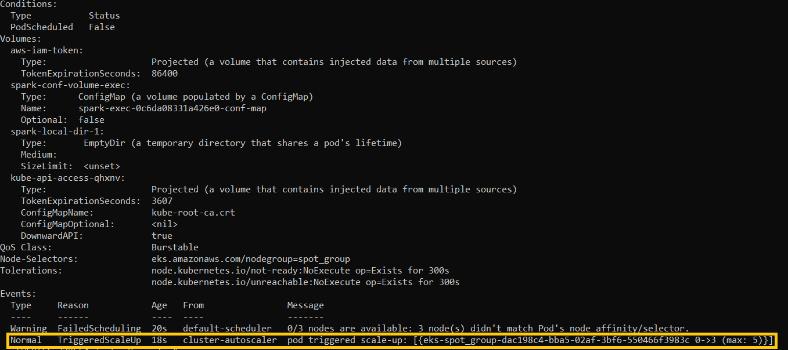

# Deploying a dynamic spark cluster on EKS

This project installs a dynamic spark cluster on the AWS cloud. In this cluster, data are stored on S3 and are processed by spark applications that are scheduled a fleet of EC2 spot instances. These instances are created dynamically when needed and are managed by an EKS kubernetes cluster. The solution has been based on various open-source technologies and tools that are deployed using Terraform. The following sections describe the architecture in more detail. 

## Networking


The solution is implemented on a custom VPC composed of one public subnet and three private subnets. The EKS cluster is installed on the private subnets and is not accessible from the public Internet. Users can access the cluster by connecting to an OpenVPN server deployed on the public subnet of the infrastructure. Additionally, a NAT instance is also deployed to allow EKS worker nodes to download packages and security updates. For reducing the overall networking costs, a VPC private gateway endpoint is created for connecting to the Amazon S3 service. This reduces the data transfer costs when reading and writing data to S3 buckets during the execution of spark applications. For making the architecture more resilient to failures, additional public subnets could be deployed at different AZs, each with their own NAT instance and OpenVPN server. However, for the sake of simplicity and for reducing costs, in this project, we will adopt the simple approach with one public subnet.

## EKS cluster

The EKS cluster consists of a set of worker nodes that are divided into two groups, the "on_demand_group" and the "spot_group". The "on_demand_group" is dedicated for hosting the critical services of the cluster which should run uninterrupted, while spark application executors are deployed on the "spot_group". Given that the spark driver is important for application recovery, it is recommended to schedule it on the "on_demand" group. The parameters of the EKS cluster node groups are provided in the following input map variable:

```
eks_node_groups = {
    on_demand_group = {
      min_size       = 3
      desired_size   = 3
      max_size       = 6
      instance_types = ["t3.medium"]
      disk_size      = 20
      capacity_type  = "ON_DEMAND"
    }
    spot_group = {
      min_size       = 0
      desired_size   = 0
      max_size       = 5
      instance_types = ["t3.medium"]
      disk_size      = 20
      capacity_type  = "SPOT"
    }
  }
```

This variable defines, the min, desired, and max size of each node group along with the respective instance type and EBS disk capacity in GBs. The size of the node groups is automatically adjusted by the EKS cluster autoscaler. This component is responsible for continuously monitoring the available computing resources in the cluster and the current demand placed by deployed applications. If the demand exceeds the available capacity, it scales up the appropriate EKS node group(s) by launching additional EC2 instances, while if the demand is low, it terminates unneeded instances.

The provision of persistent volumes in the cluster is performed over an EFS file system. The advantage of EFS volumes is that they can be attached to pods at different AZs in contrast to EBS volumes which are bound to a specific AZ. The creation and management of EFS volumes is performed by the EFS CSI driver component. 

## Kubernetes addons

For being able to access services and applications deployed on EKS from outside the cluster, additional components are installed using helm charts. These components are responsible for creating TLS certificates for new applications (certificate manager), for routing https requests to the appropriate kubernetes services (ingress nginx) and for publishing DNS records to a Route53 domain deployed within the VPC (external DNS). With these components, important UIs, such as, grafana, prometheus, spark history server, and spark application UIs become accessible to users from their browsers.   

Another important kubernetes component is kube prometheus stack used for monitoring and alerting. The stack installs a daemonset of node exporter pods that collect system-level metrics from each worker node and exposes them to prometheus. Grafana is also deployed with a set of pre-configured dashboards which provide visualizations of various metrics related to the kubernetes infrastructure and deployed applications. 

## Spark components

In this solution, several tools have been installed to aid in the development, testing, and deployment of spark applications. Developers can have their own isolated environments in JupyterHub for developing the spark applications. Through interactive notebooks, they can access datasets that reside on S3 buckets, process them and produce outputs and visualizations. After a spark application has been developed and thoroughly tested, it can be deployed to the cluster using the spark operator. 

For spark applications, two dedicated S3 buckets are created, one for storing the data to be processed, and one for keeping the history of event logs of all executed applications. For being able to access these S3 buckets, application pods should be executed with a service account that has been assigned a role with the appropriate IAM permissions for reading and writing objects to these buckets.  

With the spark operator, spark applications can be submitted to the kubernetes API using CRD files. These files define all required spark parameters, such as, the mode of execution, application image, spark configuration options, spark UI options, and specifications for the driver and executors. An example of a CRD file for executing a pyspark application can be found in the project's examples. The history of executed spark applications and their logs are accessible from the spark history server UI. This server accesses the logs of past executed applications from the corresponding spark event logs S3 bucket.

## Terraform modules

The source code of this repository deploys the following Terraform modules:

| Module                                                                                                         | Description                                                                                                                               |
| -------------------------------------------------------------------------------------------------------------- | ----------------------------------------------------------------------------------------------------------------------------------------- |
| [terraform-aws-custom-vpc](https://github.com/gfortetsanakis/terraform-aws-custom-vpc)                         | Creates the VPC of the infrastructure                                                                                                     |
| [terraform-aws-openvpn-server](https://github.com/gfortetsanakis/terraform-aws-openvpn-server)                 | Deploys on OpenVPN server                                                                                                                 |
| [terraform-aws-nat-instance](https://github.com/gfortetsanakis/terraform-aws-nat-instance)                     | Deploys a NAT instance                                                                                                                    |
| [terraform-aws-eks-cluster](https://github.com/gfortetsanakis/terraform-aws-eks-cluster)                       | Creates the EKS cluster                                                                                                                   |
| [terraform-helm-eks-autoscaler](https://github.com/gfortetsanakis/terraform-helm-eks-autoscaler)               | Installs the [cluster-autoscaler chart](https://github.com/kubernetes/autoscaler/tree/master/charts/cluster-autoscaler)                   |
| [terraform-helm-efs-csi-driver](https://github.com/gfortetsanakis/terraform-helm-efs-csi-driver)               | Installs the [efs-csi-driver chart](https://github.com/kubernetes-sigs/aws-efs-csi-driver/blob/master/charts/aws-efs-csi-driver)          |
| [terraform-helm-external-dns](https://github.com/gfortetsanakis/terraform-helm-external-dns)                   | Install the [external-dns chart](https://github.com/kubernetes-sigs/external-dns/tree/master/charts/external-dns)                         |
| [terraform-helm-ingress-nginx](https://github.com/gfortetsanakis/terraform-helm-ingress-nginx)                 | Installs the [ingress-nginx chart](https://github.com/kubernetes/ingress-nginx/tree/main/charts/ingress-nginx)                            |
| [terraform-helm-cert-manager](https://github.com/gfortetsanakis/terraform-helm-cert-manager)                   | Installs the [cert-manager chart](https://github.com/cert-manager/cert-manager/tree/master/deploy/charts/cert-manager)                    |
| [terraform-helm-kube-prometheus-stack](https://github.com/gfortetsanakis/terraform-helm-kube-prometheus-stack) | Installs the [kube-prometheus-stack chart](https://github.com/prometheus-community/helm-charts/tree/main/charts/kube-prometheus-stack)    |
| [terraform-aws-s3-bucket](https://github.com/gfortetsanakis/terraform-aws-s3-bucket)                           | Creates S3 buckets on AWS for spark                                                                                                       |
| [terraform-helm-jupyter-hub](https://github.com/gfortetsanakis/terraform-helm-jupyter-hub)                     | Installs the [jupyterHub chart](https://github.com/jupyterhub/helm-chart)                                                                 |
| [terraform-helm-spark-operator](https://github.com/gfortetsanakis/terraform-helm-spark-operator)               | Installs the [spark-operator chart](https://github.com/GoogleCloudPlatform/spark-on-k8s-operator/tree/master/charts/spark-operator-chart) |

## Installation instructions

Before proceeding with the installation, the following software components should be first installed on the local machine:

- Terraform

- AWS CLI

- Kubectl

- OpenVPN client

The required input parameters of the provided Terraform script are the following:

| Parameter                   | Module                | Description                                                                              | Default    |
| --------------------------- | --------------------- | ---------------------------------------------------------------------------------------- | ---------- |
| aws_region                  | custom-vpc            | The aws region at which the infrastructure will be set up                                | eu-north-1 |
| openvpn_client_cidrs        | OpenVPN server        | List of CIDR blocks that are allowed to connect to the OpenVPN server                    |            |
| openvpn_key_path            | OpenVPN server        | Path to a public key file to be installed on the OpenVPN server for connecting via ssh   |            |
| openvpn_instance_type       | OpenVPN server        | The instance type of the openVPN server                                                  | t3.micro   |
| openvpn_user                | OpenVPN server        | Name of the first OpenVPN user to be created during the server installation              |            |
| nat_instance_key_path       | NAT instance          | Path to a public key file to be installed on the NAT instance for connecting via ssh     |            |
| nat_instance_type           | NAT instance          | The instance type of the NAT instance                                                    | t3.micro   |
| eks_worker_nodes_key_path   | EKS cluster           | Path to a public key file to be installed to the EKS worker nodes for connecting via ssh |            |
| kubernetes_addons_namespace | EKS cluster           | The namespace on which kubernetes components are installed                               | addons     |
| domain                      | External DNS          | The domain of the Route53 private hosted zone to be created within the VPC               |            |
| cluster_issuer_cert_path    | Certificate manager   | Path to the certificate file of the CA used to issue application certificates            |            |
| cluster_issuer_key_path     | Certificate manager   | Path to the private key file of the CA used to issue application certificates            |            |
| history_server_spark_image  | Spark operator        | The spark image used for deploying the spark history server                              |            |
| jupyter_notebook_image      | JupyterHub            | The Jupyter notebook image                                                               |            |
| docker_registry_server      | JupyterHub            | The docker registry hosting the docker image for Jupyter notebook                        |            |
| docker_registry_username    | JupyterHub            | The docker registry username                                                             |            |
| docker_registry_password    | JupyterHub            | The docker registry password                                                             |            |
| docker_registry_email       | JupyterHub            | The docker registry email account                                                        |            |
| grafana_admin_password      | Kube prometheus stack | The admin password for grafana                                                           |            |

Regarding the spark and Jupyter notebook images, it is necessary to support the latest s3a connector. That way spark applications will be able to read and write data to S3 buckets with the best possible performance. A pre-build docker image that could be used for the spark history server which supports the S3a connector is "datamechanics/spark:3.2-latest" that is available on [DockerHub](https://hub.docker.com/r/datamechanics/spark). For building an image with s3a support for the Jupyter notebook, a Dockerfile is provided in the Docker folder of this repository. After building the image, it can be uploaded on a docker registry from which it will be pulled during the deployment of the JupyterHub chart. 

#### Installation steps

1. Clone the repository:
   
   ```
   git clone https://github.com/gfortetsanakis/dynamic-spark-cluster-on-eks.git
   ```

2. cd to the repository directory:
   
   ```
   cd dynamic-spark-environment-on-eks
   ```

3. Create a "terraform.tfvars" file and define values for all input parameters described in the previous section.

4. Edit the locals.tf file, modify the "eks_node_groups" variable according to your needs and define the names of S3 buckets to be created for spark in "s3_buckets" variable:
   
   ```
   eks_node_groups = {
     on_demand_group = {
       min_size       = 3
       desired_size   = 3
       max_size       = 6
       instance_types = ["t3.medium"]
       disk_size      = 20
       capacity_type  = "ON_DEMAND"
     }
     spot_group = {
       min_size       = 0
       desired_size   = 0
       max_size       = 5
       instance_types = ["t3.medium"]
       disk_size      = 10
       capacity_type  = "SPOT"
     }
   }
   
   s3_buckets = {
     spark_logs = "example-spark-logs-bucket"
     spark_data = "example-spark-data-bucket"
   }
   ```

5. Initialize terraform:
   
   ```
   terraform init
   ```

6. After the successful initialization of Terraform, proceed with the deployment of the custom vpc and OpenVPN server modules:
   
   ```
   terraform apply --target=module.custom-vpc --target=module.openvpn-server
   ```

7. Wait until the OpenVPN server EC2 instance is successfully initialized. Then connect  to the instance via ssh and download the .ovpn file that has been created inside the home directory of the "ec2-user".

8. Import the .ovpn file in the OpenVPN client software on your machine and connect to the OpenVPN server.

9. Install the remaining components of the infrastructure:
   
   ```
   terraform apply
   ```

10. Test accessing the UIs of the kubernetes components (spark history server, grafana, prometheus, alert manager). The URLs of these UIs are provided in the output of the Terraform script. 

11. Use the aws cli to download the kubeconfig file for the eks cluster:
    
    ```
    aws eks --region <eks_cluster_region> update-kubeconfig --name <eks_cluster_name>
    ```

12. Test executing kubectl commands:
    
    ```
    kubectl get nodes
    ```

#### Example

As an example, we will execute a collaborative filtering machine learning application using pyspark. This application analyzes the movieLens dataset with 1M ratings. It uses cross validation to tune the "rank" hyperparameter of the LSE algorithm and produces a model. Then, using this model an output Dataframe is produced containing 10 movie recommendations for each user in the initial dataset. This Dataframe is then exported to S3 in parquet format. To run this application, perform the following steps:  

1. From the [movieLens](https://grouplens.org/datasets/movielens/) site, download the "MovieLens 1M Dataset". Then, extract the zip file and upload the directory "ml-1m" to the spark data S3 bucket at the following path:
   
   ```
   s3://<spark_data_s3_bucket>/ml-1m/
   ```

2. cd to the "movie_recommendations" directory:
   
   ```
   cd Examples/movie_recommendations
   ```

3. Build the application image. In this example, we will based on "datamechanics/spark:3.2-latest" that is available on [Docker Hub](https://hub.docker.com/r/datamechanics/spark) as a base image:
   
   ```
   docker build -t <image_tag> .
   ```

4. Push the image to a docker repository and create a secret with the credentials for this repository on the "spark" namespace of the EKS cluster.

5. Edit the "movie_recommendations.yaml" file and replace the following parameters:
   
   | Parameter                                | Description                                          |
   | ---------------------------------------- | ---------------------------------------------------- |
   | <spark_data_s3_bucket>                   | The S3 bucket hosting the spark data                 |
   | <spark_event_logs_s3_bucket>             | The S3 bucket storing the logs of spark applications |
   | <movie_recommendation_image>             | The image of the spark application build above       |
   | <movie_recommendation_image_pull_secret> | The image pull secret                                |
   | <movie_recommendation_spark_UI_url>      | The url from which the spark UI will be accessible   |

6. Deploy the application on the cluster:
   
   ```
   kubectl apply -f ./movie_recommendations.yaml
   ```

7. Initially, the executor pods of the application will be in pending state given that the "spot_group" is empty. By describing these pods, there will be event at the end of the log stating that the cluster autoscaler has created a scale up event:
   
   

8. During the execution of the application, the spark UI will be accessed from the URL defined in "movie_recommendation.yaml":
   
   

9. The utilization of computing resources by the spark executors can be monitored in grafana:
   
   

10. After the execution of the application, the output dataset should be stored on s3 under the path "s3://<spark_data_s3_bucket>/ml-1m/output". The logs of the application will be accessible from the spark history server:
    
    
